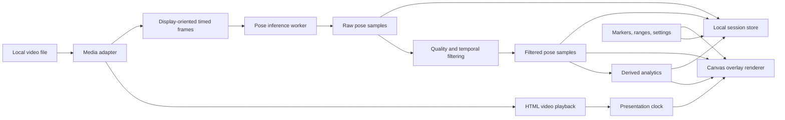

# Crux Vision rebuild report

**Date:** July 22, 2026
**Status:** Product and technical recommendation; roadmap maintained separately

## Executive recommendation

Restart the application rather than extending the legacy implementation.

The new Crux Vision should be a **local-first, mobile-capable video analysis
workspace for climbers**, not initially an “AI coach.” The most valuable first
product is a fast, precise player combined with pose, a live skeleton, and
selectable joint trails. The player is necessary infrastructure, but a generic
player by itself is not a compelling Crux Vision product. Pose should appear
progressively, never require a newly rendered video, and never present uncertain
inferences as facts.

The recommended shape is:

1. A responsive React/TypeScript web application that opens a local video
   immediately on a computer or phone.
2. A custom analysis transport and timeline built around the browser's video
   element rather than a custom codec or player engine.
3. Live Canvas 2D overlay layers synchronized to video presentation timestamps.
4. On-device, in-browser, worker-isolated pose extraction, initially using
   MediaPipe Pose Landmarker, with a measured pose-data-only server fallback if
   a target phone cannot meet the performance budget.
5. MediaBunny/WebCodecs evaluated for rotation-aware metadata and offline frame
   extraction; FFmpeg retained as a compatibility and canonicalization fallback.
6. Raw pose data, filtered pose data, annotations, and derived metrics stored
   separately from the source video.
7. One-video review first, then a two-video `PlaybackGroup` using the same player
   core. On a phone, comparison favors stacked, A/B, and superimposed views over
   squeezing two tiny players side by side.

The critical product principle is simple: **video is the source; pose is timed
data; visuals are live views of that data.** This removes the old architecture's
largest causes of latency and fragility.

## Product definition

### Proposed positioning

> Crux Vision is a movement-analysis studio for climbers: review movement in
> detail, compare attempts, and use confidence-aware pose visualizations to find
> differences worth investigating.

This positioning leaves room for powerful automation without promising that a
single monocular camera can measure force, energy expenditure, or technique
quality reliably.

### Primary workflow

1. Import one video and begin watching immediately.
2. Set the start and end of the climbing section.
3. Scrub, slow down, frame-step, loop, zoom, and add named markers.
4. Let pose analysis fill in progressively without blocking review.
5. Toggle skeleton, trails, angles, motion vectors, and quality information.
6. Inspect segment-level measurements and their valid-data coverage.
7. Optionally add a second attempt, synchronize a shared event, and compare.
8. Save or export the analysis state independently of a rendered video.

### Principles

- **Immediate before intelligent.** The source video must be useful before pose
  processing finishes.
- **Assist observation.** Visuals and metrics help the user investigate; they do
  not replace the user's judgment.
- **Evidence with uncertainty.** Every derived result carries quality/coverage.
- **One coordinate contract.** The pixels used for pose, playback, and overlay
  all agree about rotation, mirroring, crop, and time.
- **Non-destructive layers.** Settings change a view, not the media file.
- **Comparison is designed in, not built first.** The player controller should
  support groups, but the first interface should perfect one video.
- **Mobile is a primary surface.** Portrait use, touch, limited memory, battery,
  and thermal throttling are product constraints from the first milestone, not
  a later responsive-design pass.
- **Experimental means experimental.** A compelling proxy is not renamed as
  force, power, fatigue, or efficiency.

## Legacy audit

The original project was useful because it proved that MediaPipe can find a
climber and that motion trails are visually meaningful. Its climbing-video
corpus is especially valuable. Its implementation should not be reused as the
new foundation.

### What it currently does

The legacy app is a React/Vite page backed by FastAPI. A file upload creates an
in-process background task. OpenCV decodes up to a configured number of frames,
MediaPipe Solutions returns 33 landmarks per frame, JSON is written to disk, and
OpenCV decodes the video again to draw a skeleton and two trails. OpenCV first
encodes an `mp4v` file; FFmpeg then re-encodes that output as H.264 for browser
playback. The frontend polls until the baked result is available.

### Findings

| Area | Finding | Consequence |
|---|---|---|
| Media model | Source video, pose, visuals, and delivery format are coupled into one rendered output. | No instant playback, live toggles, restyling, or cheap analytics changes. |
| Processing | Frames are buffered in a Python list; the source is decoded again for overlay; the output is encoded twice. | High memory, latency, and operational complexity. |
| Trail rendering | Each historical dot copies and alpha-blends the entire image. | Work grows with both resolution and trail length. |
| Orientation | Coded dimensions, display-matrix rotation, pose coordinates, writer dimensions, and manual frame rotation are handled in different functions. | A small sign/order mismatch can rotate video and overlay differently. |
| Time | Pose is keyed by sequential `frame_index` and trails use nominal FPS. | Variable-frame-rate, dropped, trimmed, or sampled video can drift. |
| Processing cap | Pose defaults to 450 frames, but the overlay pass continues through the full clip. | At 30 fps, pose can silently stop after about 15 seconds while the remaining video has no overlay. |
| Lookup | Overlay frame matching scans the pose list for every video frame. | Avoidable quadratic work. |
| Confidence | Intended per-body-part thresholds are recorded but rendering uses one global `0.5`; landmark group lookup does not match names such as `left_wrist`. | The apparent configuration is not the behavior. |
| Quality flags | Hand detection searches for the word `hand`, but landmarks are wrist/index/pinky/thumb; several other flags are never calculated. | Quality metadata is misleading or empty. |
| Metrics | API angle/stability fields and feedback are placeholders. | The app is a video effect pipeline, not yet an analysis product. |
| Jobs/storage | FastAPI `BackgroundTasks`, a shared global pose object, in-memory job records, and local disk are used. | Concurrency and restart behavior are unsafe for production. |
| Upload | The entire upload is read into memory before saving. | Large files add another memory spike. |
| UX | The final result uses native video controls and the upload screen disappears while processing. | The core analysis interactions do not exist. |
| Tests | Documentation describes manual checks, but there is no automated test suite. | Orientation and timing regressions are easy to reintroduce. |
| Repository | The working directory is about 3.4 GB; source climbing videos account for about 907 MB and Git history about 1.6 GB. | The fixtures are valuable, but ordinary Git is the wrong media store. |

### Local proof-of-concept measurements

These are diagnostic measurements on an Apple M3 using the legacy environment,
not production benchmarks:

- The portrait fixture is coded as 1920×1080 with a −90° display rotation.
  OpenCV 4.11 reports the raw 1920×1080 image and has automatic orientation
  disabled. The old pose path therefore sees raw coded orientation while the
  later overlay path applies rotation manually.
- The same pattern exists in several normal climbing fixtures. One landscape
  fixture carries a −180° display rotation, showing why “portrait if height is
  greater than width” is not a sufficient rule.
- The legacy MediaPipe model processed resized samples at roughly 68–78 frames
  per second. A 30-second, 30 fps clip is therefore not intrinsically a
  multi-minute pose-inference problem on this hardware.
- Rotating the test frames into displayed orientation did not materially change
  aggregate detection rate on three fixtures. That does **not** make the old
  approach correct: it only shows that this model tolerated those rotations.
  Coordinates and rendered pixels still require one explicit contract.
- With two full 2-second trails (120 active points), the legacy trail function
  rendered a 1080p frame in about 0.165 seconds—about **6.1 fps**. That alone is
  roughly 127 seconds of work for a 25.7-second, 30 fps clip. Pose inference and
  transcoding come afterward.

This evidence strongly supports removing baked rendering instead of trying to
micro-optimize the old loop.

### What to preserve

- The original videos as a private evaluation corpus.
- The observation that hip/shoulder or joint trails make motion differences
  visible.
- Raw landmark visibility values rather than only storing filtered coordinates.
- The idea of configurable confidence, expanded into a coherent quality model.
- The incremental, milestone-based development style.

## Recommended architecture



### Tooling in plain English

These names describe software components, not cloud services:

- **MediaBunny** is a JavaScript library we install in Crux Vision. It reads the
  structure of a media file—tracks, timestamps, codecs, dimensions, and rotation—
  and can request particular video samples. Think of it as the translator
  between a phone video file and the browser's low-level media machinery
  ([website and documentation](https://mediabunny.dev/)). Using MediaBunny does
  not by itself upload the video anywhere.
- **WebCodecs** is a browser API, similar in category to Canvas or Web Audio. It
  gives our JavaScript efficient access to decoded video frames and the device's
  available decoders. It deliberately does not understand complete MP4/MOV
  containers, which is why MediaBunny is useful in front of it
  ([MDN introduction](https://developer.mozilla.org/en-US/docs/Web/API/WebCodecs_API),
  [W3C specification](https://www.w3.org/TR/webcodecs/)).
- **FFmpeg** is a mature open-source multimedia toolkit and command-line program
  for inspecting, decoding, converting, filtering, and encoding video. `ffprobe`
  is its companion inspector for metadata such as codecs, dimensions, and
  display transforms ([FFmpeg overview](https://ffmpeg.org/about.html),
  [documentation](https://ffmpeg.org/documentation.html),
  [ffprobe documentation](https://ffmpeg.org/ffprobe.html)). It is not a hosted
  API. In this plan it is a compatibility tool outside the normal player path,
  not something every phone must run for every video.

The ordinary route is therefore: the browser's video element plays the file;
MediaBunny interprets its container and timing when we need analysis frames;
WebCodecs lets the browser decode those frames efficiently. FFmpeg is the rescue
path for a file the browser cannot decode or whose metadata needs diagnosis.

### Frontend application

Use React, TypeScript, and Vite for a client-heavy single-page workspace. There
is no meaningful server-rendering requirement, so a full-stack React framework
would add routing/deployment conventions without helping the hard media work.

Use:

- React for workspace UI and panels.
- Plain TypeScript controller objects for media clocks, playback groups, and
  analysis jobs; high-frequency video state should not cause whole-app React
  renders.
- Tailwind CSS plus accessible headless primitives (for example Radix-based
  components) for a consistent visual system.
- Canvas 2D for skeletons, paths, arcs, arrows, and heatmaps. It is sufficient
  for the proposed layers and simpler than a scene graph or WebGL engine.
- `HTMLVideoElement.requestVideoFrameCallback()` to render the overlay for the
  frame actually sent to the compositor. The callback exposes `mediaTime` and
  presented-frame metadata and is designed for per-frame video work
  ([MDN](https://developer.mozilla.org/en-US/docs/Web/API/HTMLVideoElement/requestVideoFrameCallback)).

Do not use React component state as the playback clock, and do not update the
DOM once per landmark.

### Mobile product and UX contract

“Chrome” is a sufficient target only when qualified by platform. The named gym
reference device is an **iPhone 15 running iOS 26.5, with Chrome as the user's
preferred browser**. That makes iOS/WebKit behavior an immediate compatibility
target: Apple's alternative browser-engine path remains region- and
entitlement-specific
([Apple's current guidance](https://developer.apple.com/support/alternative-browser-engines/)).
Run media, pose, memory, battery, and thermal tests on that physical iPhone—not
only in responsive desktop emulation. Chromium Chrome on desktop remains the
fast development browser, but passing desktop Chrome does not establish mobile
compatibility.

The phone interface should not shrink the desktop arrangement. Use three
progressive surfaces:

1. **Review:** the video and live overlay dominate the screen, with a compact
   bottom transport for play/pause, speed, loop, checkpoint return, and overlay
   visibility.
2. **Inspect:** a draggable bottom sheet exposes joint selection, trails,
   confidence/quality, and the current measurement without covering the climber.
3. **Timeline:** an expanded sheet or landscape layout provides fine scrubbing,
   range handles, markers, quality coverage, and charts.

Mobile interaction requirements:

- large touch targets and no hover-only controls;
- tap to play/pause, horizontal drag for scrubbing, pinch to zoom, two-finger
  pan, and a reset-view affordance;
- coarse scrubbing by default, then precision scrubbing/frame nudging after a
  press or zoom gesture;
- optional haptic feedback at In/Out points and checkpoints;
- portrait and landscape workspace modes with no forced media reorientation;
- stacked, rapid A/B switching, or opacity/skeleton superposition for comparison
  on a phone; side by side is mainly for landscape phones, tablets, and desktop;
- visible analysis status and the ability to review immediately while pose fills
  in;
- analysis of a selected range so users do not spend phone battery processing
  the floor setup before the climb or the walk away afterward;
- adaptive analysis resolution and sample rate, with a measured “precision”
  option for fast dynamic moves rather than one untested setting for every phone;
- bounded memory: stream frames, never retain a decoded video in RAM, and never
  create a duplicate rendered video merely to show an overlay.

A PWA/home-screen install and offline asset cache are reasonable after the first
useful slice. A native mobile app is not the starting point; it remains an option
only if browser codec, sustained inference, file access, or thermal behavior
fails on the reference phone.

### Media adapter

Start the technical spike with **MediaBunny** as the browser media adapter. It
can inspect duration, codec, resolution, rotation, tracks, and timestamps and
can expose decoded samples through WebCodecs without hand-writing a demuxer
([project documentation](https://mediabunny.dev/),
[sample sink API](https://mediabunny.dev/api/VideoSampleSink)). It is MPL-2.0,
usable in closed-source applications, but is a fast-moving dependency. Pin it
and hide it behind a small interface.

The adapter should provide:

- `inspect(file) -> SourceMetadata`
- `samples(timestamps) -> AsyncIterable<TimedVideoSample>`
- `canDecode(metadata) -> capability result`
- an immediate object URL for ordinary playback

Use the browser's Media Capabilities API to distinguish “recognized” from likely
smooth/power-efficient decode
([MDN](https://developer.mozilla.org/en-US/docs/Web/API/Media_Capabilities_API)).

WebCodecs exposes efficient, low-level `VideoFrame` objects and includes rotation
and flip in the frame model, but it intentionally does not demux containers
([W3C specification](https://www.w3.org/TR/webcodecs/),
[MDN overview](https://developer.mozilla.org/en-US/docs/Web/API/WebCodecs_API)).
That is why a media adapter is preferable to custom WebCodecs plumbing.

### Compatibility fallback

Do not use `ffmpeg.wasm` as the normal path. Shipping and running a full software
codec stack in the browser would recreate long waits and high memory use.

If the browser cannot decode an imported iPhone MOV/HEVC or another source:

1. Tell the user exactly what is unsupported.
2. Offer a server/local FFmpeg compatibility conversion to a canonical H.264
   proxy.
3. Apply the complete display transform once while creating that proxy, then
   clear the transform metadata.
4. Keep timestamps and a mapping back to source time.

FFmpeg display rotation is an affine display matrix, not just a portrait flag
([FFmpeg display-matrix API](https://www.ffmpeg.org/doxygen/trunk/group__lavu__video__display.html)).

### Pose engine

Use the current **MediaPipe Tasks Pose Landmarker** as the first candidate, not
the deprecated/pinned `mp.solutions.pose` path from the legacy app. It returns 33
landmarks, normalized image coordinates, world-coordinate estimates, presence,
visibility, and optional segmentation. The model is aimed at on-device fitness
work and has lite/full/heavy variants
([Google overview](https://developers.google.com/edge/mediapipe/solutions/vision/pose_landmarker),
[web guide](https://developers.google.com/edge/mediapipe/solutions/vision/pose_landmarker/web_js)).

**On-device does mean the phone or computer runs pose inference.** MediaPipe
Pose Landmarker is not a hosted pose endpoint that Crux Vision calls once per
frame. The web app downloads a JavaScript/WASM runtime and a model asset, which
we can serve from our own application, and runs that model against frames in the
browser. Google states that MediaPipe Tasks does not send input video/images to
Google servers. Its current privacy notice separately says the library sends
performance and utilization metrics, so telemetry behavior, disclosure, and any
available controls must be checked before public release
([MediaPipe Tasks and privacy notice](https://developers.google.com/edge/mediapipe/solutions/tasks)).

The browser still downloads the Crux Vision app and model the first time. After
those assets are cached, pose processing can be local and potentially offline.
We may later add our own services for sharing, accounts, backup, or a compatibility
fallback, but those are separate product choices—not a requirement imposed by
MediaPipe. A fallback should return timed pose data, never require baking the
overlay into another video.

MediaPipe's web calls are synchronous and block their calling thread; Google's
guide explicitly recommends a web worker. The spike must validate which of
`VideoFrame`, `ImageBitmap`, or `OffscreenCanvas` gives the best reliable worker
path across target browsers. Keep the pose engine behind an adapter:

- `load(modelVersion, delegate)`
- `analyze(sample) -> RawPoseSample`
- `dispose()`

Do not choose “full” or “heavy” by intuition. Benchmark lite/full/heavy on the
legacy corpus for hand/foot stability, occlusion, fast movement, cold start,
throughput, and memory.

#### Alternatives to benchmark, not adopt initially

| Candidate | Strength | Concern | Role |
|---|---|---|---|
| MediaPipe Pose Landmarker | 33 climbing-useful landmarks; web runtime; tracking; visibility/presence. | Preview API and poor domain certainty under wall occlusion. | Recommended first candidate. |
| MoveNet Lightning/Thunder | Mature TensorFlow.js path and 17-keypoint real-time baseline ([TensorFlow](https://blog.tensorflow.org/2021/05/next-generation-pose-detection-with-movenet-and-tensorflowjs.html)). | Fewer hand/foot landmarks and no equivalent 33-point geometry. | Speed/robustness baseline. |
| RTMPose or another ONNX model | Flexible model choice and WebGPU/WASM through ONNX Runtime Web ([docs](https://onnxruntime.ai/docs/tutorials/web/)). | More preprocessing, model licensing, keypoint mapping, and uneven WebGPU support. | Later challenger if MediaPipe fails corpus benchmarks. |
| Ultralytics pose | Convenient and strong general tooling. | Ultralytics states that its code/models require AGPL project disclosure or an enterprise license ([license](https://www.ultralytics.com/license)); default models also use fewer keypoints. | Avoid as the default. |

#### Parked research: ClimbingCap and AscendMotion

ClimbingCap is a useful confirmation that climbing pose is difficult, but it is
not part of the Crux Vision plan. It relies on synchronized RGB and LiDAR for
full 3D world-coordinate recovery, while this product must work from ordinary
phone video. AscendMotion also requires separate commercial licensing.

**Do not implement, adapt, benchmark, download, or train against ClimbingCap or
AscendMotion unless the user explicitly reopens that research.** This note exists
only to prevent future agents from rediscovering it and mistaking it for a
roadmap direction.

### Data model

Use timestamps in integer microseconds internally. Do not rely on nominal FPS or
array index as identity.

Conceptually:

```text
SourceAsset
  source id, file fingerprint, duration
  codec and coded dimensions
  display width/height
  display matrix: rotation + flip
  presentation time range and nominal frame rate

RawPoseSample
  presentation timestamp
  model/version/delegate
  33 image-normalized landmarks: x, y, z, presence, visibility
  optional world landmarks

FilteredPoseSample
  presentation timestamp
  filtered coordinates
  per-joint state: observed, accepted, imputed-short-gap, rejected, missing
  rejection reasons

AnalysisRange
  in timestamp, out timestamp, name, color

Marker
  timestamp, name, note, optional paired sync id

MetricResult
  metric id and version
  range id
  value and unit
  valid coverage, imputed coverage, confidence/quality flags
  parameters used
```

Use typed arrays in memory for dense time series and a readable versioned JSON
format for export/debugging. Persist the model asset checksum and metric version
so results remain reproducible.

### Local persistence

**Decision for the first version: local session persistence is enough.** Store
pose data, markers, ranges, settings, and small thumbnails in IndexedDB/OPFS
while keeping the source file external when possible. Storing every large video
as a browser database Blob wastes mobile storage and may hit browser quota.
Browser storage is best-effort by default and can be cleared by the user or under
storage pressure, so the UI must describe this honestly and fail safely
([MDN storage quotas and eviction](https://developer.mozilla.org/en-US/docs/Web/API/Storage_API/Storage_quotas_and_eviction_criteria)).

During an active session the imported `File` remains available. Across a full
browser restart, the user may need to select the source video again; match it to
the saved analysis with a fingerprint. Request persistent browser storage where
appropriate, but do not imply that it is equivalent to cloud backup.

Offer a portable Crux session export later. It can contain
metadata, pose, metrics, settings, and a source fingerprint rather than copying
the source video.

Add accounts, object storage, Postgres, and a durable worker queue only when
sharing or multi-device use is a proven need. A Python service remains a good
future home for experimental SciPy/NumPy analytics or server-only models, but it
is not required for the first product loop.

## Orientation and coordinate contract

This should be treated as a testable subsystem, not a collection of fixes.

### Canonical rule

> Every image-space pose coordinate is normalized in the upright, displayed
> video coordinate system at its presentation timestamp.

The pipeline is:

1. Read the full source display transform (including rotation and flip).
2. Decode a timed sample.
3. Present/convert that sample in displayed orientation.
4. Run pose on that displayed sample.
5. Store normalized coordinates relative to displayed width and height.
6. Compute the video's actual `object-fit` content rectangle in the player.
7. Map normalized pose coordinates through the exact same fit, crop, zoom, and
   pan matrix as the video.

Never:

- infer orientation from width versus height;
- rotate only the output while pose uses a different space;
- strip rotation metadata without applying it to pixels;
- assume a front-camera clip is unmirrored;
- join pose to media solely by `frame_index`.

### Required fixture matrix

- Pixel-native landscape with no display rotation.
- Pixel-native portrait with no display rotation.
- 90°, −90°, and 180° display matrices.
- Horizontal mirror/front-camera case.
- Non-square pixel aspect ratio if encountered.
- 24/30/60/120 fps and a variable-frame-rate phone clip.
- H.264 MP4, H.264 MOV, and HEVC MOV.
- A trimmed clip with a non-zero first presentation timestamp.
- Odd dimensions and common phone color spaces.

Each fixture should have known corner markers or a golden still so tests can
prove that video, a sample canvas, and an overlay share the same orientation.

## Player and workspace design

### Layout

Design desktop/tablet first while keeping import and basic playback usable on a
phone.

- Top bar: project/session, single/compare mode, import, save/export later.
- Center: video stage with overlays.
- Bottom: high-precision timeline with thumbnails, range, markers, pose quality,
  and movement-intensity tracks.
- Left or compact stage toolbar: transport, speed, loop, fit/zoom.
- Right inspector: overlays, confidence, selected joint/metric, marker notes.
- Compare mode: two stages or one superposition stage, with a shared control bar.

The interface should feel like a focused motion-analysis tool, not an upload
form followed by a result card.

### First-class controls

- Play/pause and click/tap stage to toggle.
- Coarse scrub plus a separate fine/jog interaction.
- Previous/next frame based on actual adjacent sample timestamps where possible.
- Speed presets: 0.1×, 0.25×, 0.5×, 0.75×, 1×, 1.5×, and 2×.
- Hold-to-jog backward/forward.
- Set In/Out; loop current range.
- Named, colored checkpoints with previous/next marker shortcuts.
- Zoom around pointer, pan while zoomed, fit/fill, reset.
- Fullscreen and a distraction-free review mode.
- Toggle all overlays and toggle individual layers.
- Snapshot current frame with or without selected overlays.
- Clear keyboard-shortcut help and touch equivalents.

Negative `playbackRate` is still not broadly implemented, so smooth browser
reverse cannot be treated like ordinary playback
([MDN](https://developer.mozilla.org/en-US/docs/Web/API/HTMLMediaElement/playbackRate)).
Start with accurate backward stepping and a press-and-hold reverse jog. Evaluate
a decoded reverse-frame cache later.

`fastSeek()` trades accuracy for speed and is not broadly available; precise
analysis seeks should set `currentTime` and confirm the presented timestamp
([MDN](https://developer.mozilla.org/en-US/docs/Web/API/HTMLMediaElement/fastSeek)).

### Quality-of-life additions

- Scrub-preview thumbnails.
- Recent range history and “return to last play start.”
- Marker labels such as start, crux, foot slip, release, catch, and finish.
- Optional metronome/time grid and elapsed time from range start.
- Ghost previous/next pose or selected keyframes (“stromotion”).
- Manual rotate/mirror override for damaged metadata, clearly marked as a source
  interpretation that requires pose reanalysis.
- Annotation arrows, lines, angle tools, and voice notes later.
- Capture guidance: stable camera, entire climber visible, avoid digital zoom,
  prefer high frame rate for dynos, and record enough route context.

Established sports-analysis tools validate many of these interactions. Kinovea
supports common-event synchronization, joint frame stepping, linked speed, and
50% superposition
([documentation](https://www.kinovea.org/help/en/observation/comparison.html));
Onform exposes macro/fine scrubbers, frame controls, range loop, slow motion,
multi-panel sync, calibration, and drawings
([guide](https://support.onform.com/article/153-user-guide-onform-video-analysis-app)).

## Two-video comparison design

Build the single player around a reusable `PlayerController`, then add a
`PlaybackGroup` rather than wiring two React video elements together ad hoc.

### Required behaviors

- Each player can be controlled independently.
- A group control can play, pause, seek, step, loop, or change speed for both.
- The user chooses one visible event in each clip as the synchronization origin.
- One-frame nudge buttons adjust either origin.
- The UI always shows the current offset.
- The group monitors media-time drift and makes bounded corrections.
- Either video's sound can be master; default the secondary to muted.
- Linked zoom is optional because framing often differs.

### Comparison views

1. Side by side.
2. Video A/B flicker toggle.
3. Video superposition with opacity.
4. Difference blend for nearly identical camera setups.
5. Skeleton A over video B.
6. Both skeletons in a common normalized body frame.
7. Ghost/key-pose sequence for each attempt.
8. Time-series deltas for selected angles or speed.

Raw video superposition is only meaningful when camera and wall framing are
similar. For the same climb, add a user-assisted wall alignment using two or
four common holds. For different climbs, use dimensionless/body-normalized
metrics rather than pretending pixel coordinates are comparable.

Later, support two distinct time modes:

- **Clock sync:** preserve real elapsed time after the chosen event.
- **Phase sync:** map each marked movement range to 0–100% so techniques with
  different duration can be compared.

Dynamic time warping may later suggest phase alignment, but user anchors should
remain authoritative; automatic alignment can match the wrong moves.

## Confidence and filtering strategy

Confidence is not a single global slider and not a reason to silently invent
coordinates.

### Preserve three layers

1. **Raw:** exactly what the model produced.
2. **Accepted/filtered:** quality decisions and timestamp-aware smoothing.
3. **Derived:** angles, velocity, events, and aggregate metrics.

Changing a confidence setting should recompute layers 2 and 3 from raw data; it
should not rerun the model or destroy the original result.

### Per-joint validity

For each joint and timestamp, consider:

- model presence;
- visibility/occlusion;
- image bounds;
- plausible segment length relative to neighboring accepted joints;
- velocity/acceleration plausibility in real time, not frames;
- agreement with immediate temporal neighbors;
- whether a dependent joint needed by a metric is valid.

Use hysteresis so a joint does not flicker at one threshold. A joint can require
a higher score to become accepted than to remain accepted. Bridge only short,
explicit gaps. Mark imputed samples, exclude long gaps, and never include
imputed data in a statistic without reporting it.

Smoothing is appropriate when it is a named, tested signal-processing step—not
an orientation or alignment patch. Compare a One Euro filter for responsive
visuals with an offline symmetric filter for derivatives. Velocity,
acceleration, and especially jerk must not be calculated from raw noisy pixels.

### User controls

Default UI:

- Quality preset: Strict / Balanced / Permissive.
- “Show rejected joints” debug toggle.
- Quality track on the timeline.
- Per-metric valid coverage.

Advanced UI:

- Group thresholds for hands/wrists, elbows, shoulders, hips, knees, and feet.
- Inspect a joint's presence/visibility history.
- Temporarily exclude a bad joint over a selected range.
- Choose whether short-gap interpolation is allowed for display, analytics, or
  neither.

Do not finalize default per-group thresholds until the model corpus is labeled.
Hands and feet may need different calibration, but simply lowering their
threshold can increase slingshots rather than recover truth.

### Coverage rules

Every metric should return:

- accepted sample percentage;
- imputed sample percentage;
- longest missing gap;
- body parts responsible for low coverage;
- “insufficient data” rather than a number below its validated coverage floor.

This is more useful than a single average pose confidence.

## Visual analysis ideas

### High-value, early layers

| Layer | Purpose | Notes |
|---|---|---|
| Confidence-aware skeleton | See pose and know which parts are trusted. | Hide or dash rejected connections; optional confidence colors. |
| Selectable joint trails | Reveal paths for hands, feet, hips, shoulders, or COM. | User selects joints, duration, fade, and whether trail is screen/body/wall normalized. |
| Angle arcs | Inspect elbow, shoulder, hip, and knee geometry. | Show current value and optionally a range chart. |
| Velocity arrows | Show direction and relative speed. | Scale/clamp visually; suppress low-coverage derivatives. |
| Ghost poses | Compare current pose with earlier/later checkpoints. | Excellent for body position without another video. |
| Movement heatmap | Show where a selected joint or COM spends/moves most. | Separate dwell heat from path density. |
| Quality overlay | Show missing/rejected joints and confidence timeline. | Essential for trust and threshold tuning. |

### Climbing-oriented layers

- Estimated whole-body center of mass and its path, using a documented
  anthropometric approximation.
- Shoulder and hip axes, torso lean, and body rotation proxy.
- Hand/foot contact candidates and contact-change events.
- Lines from estimated COM to active contact points.
- Reach envelope and distance-to-next-hold when holds are mapped.
- Straight-arm/bent-arm state shading during high-confidence hand contacts.
- Foot-slip candidate flash and the recovery path.
- Move phase bands: setup, initiation, travel, catch/contact, settle.
- Hold-to-hold “beta graph” after holds/contacts can be corrected by the user.
- Difference skeleton: vectors from attempt A joints to aligned attempt B joints.

### Manual annotation is strategically important

AI hold detection should not be an early dependency. Let the user click or
circle holds and correct contact events first. A small amount of reliable manual
structure unlocks better comparison, grip-readjustment detection, reach metrics,
and route-specific analysis. Automatic hold segmentation can later propose
editable regions.

## Statistical analysis ideas

### Tier A — useful with pose plus user-selected ranges

These should be the first analytics because they are explainable and can expose
coverage clearly.

| Metric | Definition direction | Value |
|---|---|---|
| Analyzed/climbing duration | Range duration; optionally auto-suggest start/end. | Basic time on wall without analyzing setup or walk-away. |
| Pose quality coverage | Accepted data by joint/group over time. | Tells the user which other results are credible. |
| Joint-angle distribution | Median, percentiles, and time in configurable bands. | More informative than a single average. |
| Movement/stillness ratio | Time classified from hip plus limb endpoint speeds. | Call this stillness, not physiological rest. |
| Limb movement bouts | Count and duration of distinct hand/foot motion episodes. | A first move-cadence measure. |
| Hip/COM path length | Body-normalized 2D path within a range. | Compare attempts with similar framing. |
| Path smoothness | Timestamped, filtered, normalized jerk or related smoothness. | Climbing research has used hip jerk as a fluency measure ([study](https://pubmed.ncbi.nlm.nih.gov/25010435/)). |
| Vertical progress profile | Body- or wall-normalized vertical displacement over time. | Shows stalls, bursts, and tempo. |
| Joint coordination lag | Relative timing of hip initiation and hand/foot motion. | Useful when comparing the same move. |

Research has also used jerk, immobility, and hold-interaction states to study
climbing fluency and preview behavior
([open-access study](https://pmc.ncbi.nlm.nih.gov/articles/PMC5404847/)).
That supports experimentation, not a universal “good technique” score.

### Tier B — valuable after calibration or editable contact detection

| Metric | Proposed interpretation | Guardrail |
|---|---|---|
| Static–dynamic index | Blend of normalized COM/limb speed, acceleration, jerk, burst duration, and dwell. | Relative to route/segment and model coverage; not a personality label. |
| Straight-arm exposure | Time-integral of elbow flexion while a high-confidence hand is likely in contact. | Separate movement/catch phases from sustained positions. |
| Contact sequence | Ordered hand/foot contact changes. | Require editable holds/contact candidates. |
| Grip readjustment candidates | Multiple detach/recontact or micro-movement events by the same hand in one hold region. | Pose fingers are weak under occlusion; surface candidates for confirmation. |
| Foot-slip candidates | Rapid downward/outward foot motion followed by contact loss/recovery. | Distinguish intentional cutting feet. |
| Three/four-point contact time | Time by estimated number of active contacts. | Contact confidence must be shown. |
| Reach utilization | Hand reach distance relative to limb/body scale and available holds. | Camera/wall alignment matters. |
| COM support relation | Projected COM relative to mapped contact geometry. | Call it a geometric relation, not force balance. |
| Path efficiency proxy | Vertical progress divided by body-normalized travel and/or time. | Not metabolic efficiency. |
| Attempt similarity | Phase-aligned distance between selected joint/angle trajectories. | Compare the same move and expose alignment anchors. |

### Tier C — experimental or not identifiable from ordinary video

#### Strength and power

A single camera cannot measure actual strength output. Mechanical COM power
would require mass, calibrated 3D COM motion, gravity direction, and kinetic
energy change; internal limb work and hold forces are still missing. Offer a
**kinematic power proxy** only after wall calibration, and never label it actual
power output.

#### Efficiency

“Efficiency” needs a declared meaning. Crux Vision can measure path economy,
time economy, stillness, or smoothness. It cannot infer metabolic energy from
pose alone. Research has found that COM position/mechanical cost and metabolic
cost need not align in climbing
([study](https://pubmed.ncbi.nlm.nih.gov/38511508/)).

#### Center of balance

Pose can estimate a projected COM. Balance requires contacts, wall geometry,
forces, and friction. Visualize COM and estimated contact geometry, but reserve
“center of balance” for a future sensor/calibrated model that earns the term.

#### Resting

A climber can be motionless while performing a strenuous isometric contraction.
Video can identify low motion or a shake-out pattern, not physiological recovery.
Use “stillness” and allow the user to label a rest.

#### Fatigue, injury risk, and coaching grades

These should not be inferred from a few noisy joint traces. Longitudinal,
route-controlled data and expert labels would be required. Avoid injury claims
and LLM-generated technique prescriptions until underlying events and metrics
are validated.

## Roadmap

The actively maintained roadmap now lives in [`../ROADMAP.md`](../ROADMAP.md).
It splits R2 into small feedback-ready slices and places a minimal physical
iPhone gate immediately after the first complete player/pose/overlay loop.

## Performance and quality budgets to establish in the spike

Use a named reference laptop and phone; do not publish unqualified speed claims.

- Source preview begins immediately without waiting for upload or analysis.
- Transport and overlay stay responsive while inference runs.
- Overlay renderer meets the display refresh budget for one and two players.
- First analyzed samples appear progressively rather than after the full clip.
- A 30-second reference clip completes within a target chosen from actual
  cross-device measurements.
- Pose results cover the selected range; no silent frame cap.
- Memory stays bounded by streaming samples, not decoded full-video buffers.
- Every orientation fixture passes video/sample/overlay alignment tests.
- Compare mode maintains a measured sync error and exposes it in diagnostics.
- Metrics fail closed with “insufficient data.”

## Testing strategy

### Automated

- Unit tests for affine transforms, object-fit rectangles, timestamp lookup,
  range math, filters, and metric coverage.
- Golden-image tests for rotation/mirror/fit/zoom overlays.
- Browser integration tests for play, seek, frame step, loop, and marker return.
- Two-player synthetic clock tests with different frame rates and durations.
- Model adapter contract tests with a tiny checked-in fixture set.
- Performance tests for overlay draw time and pose throughput, recorded rather
  than used as flaky universal pass/fail thresholds.

Use Vitest for pure TypeScript and Playwright for browser behavior. Include
WebKit in media tests; Chromium-only success is not enough for iPhone footage.

### Evaluation corpus

Do not copy all 907 MB of legacy media into ordinary Git. Curate:

- a tiny public/safe regression set in the repository;
- a private local corpus manifest pointing at legacy files;
- optional Git LFS or object storage for larger shared fixtures;
- annotations for orientation, codec, wall angle, camera viewpoint, fast move,
  occlusion, and known pose failures.

The best long-term asset may be a small, carefully labeled climbing validation
set rather than another pose model.

## What should be custom versus borrowed

### Build custom

- Analysis-focused transport/timeline interactions.
- Timestamp and coordinate contracts.
- `PlayerController` and `PlaybackGroup` synchronization.
- Canvas overlay layer system.
- Confidence/coverage pipeline and joint inspector.
- Range/marker/contact correction UX.
- Climbing-specific metric definitions and validation harness.
- Session schema and reproducibility metadata.

### Use established tools

- Browser video playback and decoding.
- MediaBunny for container/timed-sample access if the spike passes.
- WebCodecs/Media Capabilities browser APIs.
- MediaPipe/another proven pose model.
- FFmpeg/ffprobe for fallback conversion and diagnostics.
- React/Vite, accessible UI primitives, Vitest, and Playwright.
- Standard numerical filters with cited parameters rather than novel smoothing.

### Do not build yet

- A codec, demuxer, or video server.
- A custom pose network.
- A general canvas/game engine.
- A distributed job system.
- Authentication/billing.
- A universal technique or efficiency score.
- LLM coaching over unvalidated measurements.

## Decisions and open questions

### Recommended decisions now

- Rebuild from scratch in `/Users/evan/crux-vision`.
- Preserve the original repository as `/Users/evan/crux-vision-legacy`.
- Build a mobile-capable web app before considering a native mobile app.
- Use Chromium Chrome on desktop for development and an iPhone 15 running iOS
  26.5 with Chrome as the primary physical mobile target. Treat its iOS/WebKit
  behavior as an immediate compatibility requirement.
- Make a one-video player + progressive pose + skeleton + selectable trails the
  first user-visible implementation milestone. A player-only build is internal
  scaffolding, not the product checkpoint.
- Make MediaPipe Tasks the first pose candidate, not a permanent assumption.
- Make client-side analysis the preferred experiment and pose-data-only backend
  the fallback.
- Use local session persistence for v1; defer accounts, sync, saving, and sharing
  until the analysis loop proves its value.
- Treat MediaBunny as a spike dependency behind an adapter.
- Use live Canvas overlays and timestamped normalized pose data.
- Design compare controllers now, ship comparison later.
- Keep AscendMotion/ClimbingCap parked and out of implementation work unless the
  user explicitly reopens it.

### Questions best answered by prototypes/user testing

- Is a 15 fps pose sample sufficient for most review, with 30 fps for dynamic
  ranges, or does the corpus justify full source rate?
- Which pose model gives the best hand/foot stability on overhangs and occlusion?
- Does world-coordinate output add stable value, or should v1 use only 2D and
  body/wall normalization?
- Which three overlays and three metrics create the strongest initial feedback
  loop?
- How much manual hold/contact correction will users tolerate in exchange for
  substantially better climbing-specific analytics?

## Bottom line

The original project did not fail because MediaPipe was inherently too slow. It
spent most of its time manufacturing a second video and compensating for the
consequences. The rebuild should make video review and pose visualization one
workspace: the player supplies the clock and controls, pose is timestamped data,
and analysis is a set of reversible layers.

The best first work is therefore a short pose/media risk spike, followed by a
single **useful vertical slice containing the player, progressive pose, a live
skeleton, and selectable joint trails**. Confidence controls and a small set of
honest range metrics come next. This preserves a tight feedback loop without
mistaking generic player infrastructure for the distinctive product.
